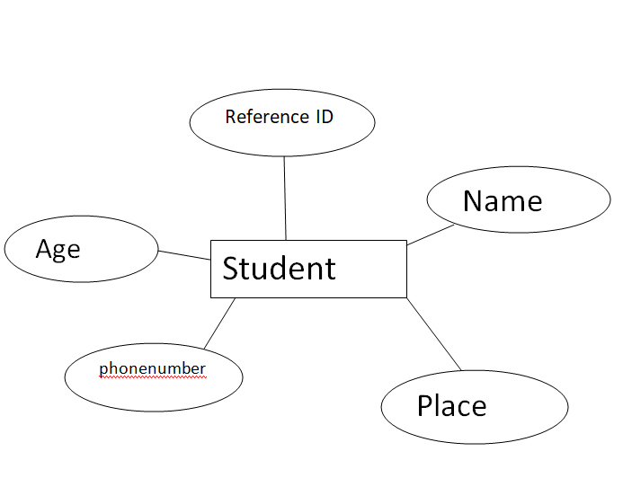
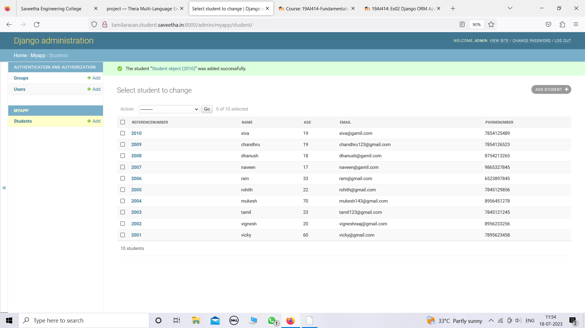
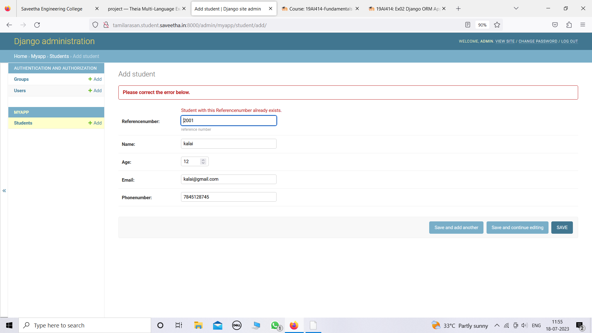

# Django ORM Web Application

## AIM
To develop a Django application to store and retrieve data from a database using Object Relational Mapping(ORM).

## Entity Relationship Diagram

### ER diagram:

## DESIGN STEPS

### STEP 1: create folder 'ex02' under the directory 'unit2'

### STEP 2: clone the Github repository into the directory 'ex02' using the command "git clone <url>"

### STEP 3: under the folder "django-orm-app", enter the directory titled "dataproject" and enter the folder "dataproject" and go to the file "setting.py", "os" in line 14, set ALLOWED_HOST=['*'] and add 'myapp' under the list INSTALLED_APPS.
Write your own steps

## PROGRAM

### models.py:
from django.db import models
from django.contrib import admin

class Student  (models.Model):
    referencenumber=models.CharField(primary_key=True,max_length=20,help_text="reference number")
    name=models.IntegerField()
    age=models.IntegerField()
    email=models.IntegerField()
    phonenumber=models.IntegerField()

class StudentAdmin(admin.ModelAdmin):
    list_display=('referencenumber','name', 'age', 'email')  

### admin.py:
from django.contrib import admin
from .models import Student,StudentAdmin

admin.site.register(Student,StudentAdmin)

## OUTPUT

### student:

### error:

## RESULT:
The Program is Executed Successfully.
